# Protocol Specification (wire version 1; Phase 2 core status)

This document distinguishes the Phase 2 implemented core from later design contracts. The Rust core implements X25519 persistent-identity abstractions, Windows/Linux protected-store adapters, local trust/revocation, canonical QR v1, volatile invitation lifecycle, QR-bound Noise XX pairing, SAS display derivation and authenticated pairing controls. The LAN CLI's older text path remains a prototype. Clipboard integration, files and additional transports remain future work. Neither the protocol wrapper nor platform adapters have received independent security review.

## Cryptographic suite and choices

Wire v1 uses `Noise_XX_25519_ChaChaPoly_BLAKE2s`, implemented by Rust `snow` 0.10.x with an explicitly restricted resolver (`use-curve25519`, `use-chacha20poly1305`, `use-blake2`, `use-getrandom`). X25519 provides DH, ChaCha20-Poly1305 is Noise's AEAD, and BLAKE2s is the Noise transcript hash. OS CSPRNG output feeds Snow's ephemeral keys and random protocol identifiers. The app envelope is carried inside Noise transport encryption on every route. BLAKE3-256 is used only as `device_id = BLAKE3(static_public_key)`; it is not used as a MAC, KDF, or password hash. SHA-256 is the future full-file integrity digest, not an authentication primitive.

Alternatives considered: mutual TLS would be mature but needs certificate/pinning UX and still requires payload encryption over a relay; Noise IK is efficient for a previously known responder key but less suited to first-contact pairing; separate Ed25519 signing and X25519 DH identities need a signed binding and rotation protocol. XX is chosen because it supports first-contact key verification and gives ephemeral-ephemeral DH. This choice does not make the wrapper audited. Before v1 release, require an independent review of the state machine/wrapper, test vectors, dependency/advisory review, review of Snow's current implementation and maintenance state, and a written decision to retain or replace Snow. Until then mark the security review gate open and make no audited/security-guarantee claim.

## Device identity, storage, and trust

Each installation creates an independent 32-byte X25519 static secret using the OS CSPRNG; its 32-byte public key is the Noise static identity. `device_id` is the 32-byte BLAKE3 fingerprint of that public key. User-selected display name and OS label are local metadata and never identity. A public key is trusted only after an authenticated, explicitly confirmed pairing transaction. Network location, discovery, display name, and a QR scan alone never imply trust.

Trust database (local only; never clipboard/file history): `trusted_devices(record_id UUID, device_id BLOB(32) UNIQUE, static_public_key BLOB(32) UNIQUE, label TEXT <= 64, min_protocol INTEGER, trusted_at, status ENUM(trusted, needs_repair))` and `revoked_devices(device_id BLOB(32) PRIMARY KEY, public_key BLOB(32), revoked_at, reason_code)`. `record_id` is an opaque local slot and is not advertised. SQLite writes use transactions and enforce uniqueness/length/status constraints. SQLite does not encrypt rows; private identity secrets are excluded, but labels and public identity metadata depend on OS database-file access controls. `needs_repair` rows are inactive: do not authorize application data. A presented key whose derived ID conflicts with an existing record is rejected. Identity replacement is never silent: revoke the old key and perform a fresh QR ceremony; a name match does not authorize replacement. Revocation writes the local denylist and removes active trust transactionally, then invalidates registered in-process sessions. Future connections check denylist before application data. Failure to erase obsolete protected key bytes is surfaced separately; it cannot undo the denylist. Re-pairing after revocation is a deliberate new trust decision.

The implemented `CBID` identity-store record is exactly 70 bytes: ASCII magic `CBID` (4), big-endian record version `1` (2), X25519 private key (32), and derived public key (32). Every load checks exact length/magic/version and recomputes the public key. `IdentityManager` does not regenerate missing/corrupt data during load; creation and replacement are explicit operations. The private field is held in `Zeroizing` buffers where practical, but copies inside crypto/OS APIs cannot be guaranteed cleared.

Production storage policy:

- Windows: use `CredWriteW` generic credentials with explicit `CRED_PERSIST_LOCAL_MACHINE`, never enterprise/roaming persistence. Store a versioned credential blob containing the secret and its derived public key; on read, enforce exact lengths and recompute/compare the public key. Use `CredReadW`, `CredWriteW`, `CredDeleteW`, and `CredFree`. If the user profile/logon credential service is unavailable, read/write fails, or the data is malformed, fail closed. Never fall back to a plaintext file. DPAPI was considered, but roaming-profile behavior and machine-scope access by all users make its scope easier to misconfigure; CredMan's explicit local persistence is preferred.
- Android: Rust core generates and represents the X25519 identity. Android Keystore generates/retains a non-exportable AES-GCM wrapping key; the Rust secret is encrypted at rest as a versioned record with a fresh 96-bit nonce, 128-bit tag, and AAD binding app ID, record version, alias ID, and public key. Keystore/provider support for direct X25519 Noise static operations is not assumed; only adopt it after provider tests and reviewed Snow integration. Plaintext fallback is forbidden. Exclude identity/trust files from cloud backup and device transfer with version-appropriate backup rules; a restored encrypted record without its Keystore key is treated as lost and must be re-paired. The secret exists in Rust process memory during a session; minimize copies and lifetime and clear buffers best-effort.
- Linux: the implemented adapter uses `secret-service` 5.1.0 over Secret Service with DH session encryption. Secret item attributes are lookup metadata and may be stored unencrypted, so contain only fixed non-secret application/schema/slot keys, never a private key, device fingerprint, account, or identifying name. Put the private material only in the Secret value. Locked collection, missing service, D-Bus/Flatpak denial, deletion, malformed/corrupt data, or provider error is a hard error; no plaintext fallback. Locked, dismissed authorization prompt, unavailable service and generic provider failures map to explicit errors. Real desktop service fault injection remains an open validation item.
- Future macOS: use Keychain with an explicit per-user/non-syncing accessibility class; validate entitlements, locked-device behavior, and migration before implementation.

Protected-store tests must inject unavailable, locked, access-denied, corrupt, deleted, replaced, and key-rotation outcomes and prove fail-closed behavior. The current unit suite validates the identity record/manager and adapter schema/constant policy, but does not yet inject native Windows Credential Manager or Linux Secret Service failures. Do not treat native adapters as independently reviewed production security boundaries.

## QR pairing invitation format and verification

The QR invitation is untrusted, short-lived connection bootstrap data; it carries a public key, not a secret or trust grant. It is canonical CBOR per RFC 8949 §4.2.1 and is a definite-length map with exactly integer keys in bytewise encoded-key order:

| Key | Type and bound | Meaning |
|---:|---|---|
| 0 | text, exactly `CLIPPAIR` | invitation magic |
| 1 | uint, exactly `1` | QR schema version (separate from wire protocol) |
| 2 | byte string, exactly 32 bytes | issuer Noise static public key |
| 3 | byte string, exactly 32 bytes | BLAKE3-256 of key 2; must match recomputation |
| 4 | byte string, exactly 16 bytes | CSPRNG single-use invitation nonce |
| 5 | array of 0–4 text strings, each ≤128 UTF-8 bytes | untrusted route/address hints; may be empty |

Total QR payload ≤512 bytes. The implementation pins `cbor2` 1.1.6, whose canonical encoder follows RFC 8949 §4.2.1. A schema-specific fixed-shape scanner checks map/key order and every declared length before owned CBOR allocations; the codec then validates, decodes, rejects duplicate keys/missing/unknown fields, and requires canonical re-encoding to equal the input byte-for-byte. It rejects tags, indefinite lengths, non-minimal integer encodings, extra trailing CBOR, wrong types, invalid UTF-8 and endpoint count/string overflow. Parser property test exists; fuzz target/corpus are checked in, but no successful fuzz execution is claimed. Endpoint hints are never authenticated by CBOR and may not include credentials or content.

Fixed QR parser vector (encoding only; uses a test-only X25519 key derived from an all-zero test secret and nonce `000102030405060708090a0b0c0d0e0f`; never use test material as identity):

```text
a60068434c49505041495201010258202fe57da347cd62431528daac5fbb290730fff684afc4cfc2ed90995f58cb3b74035820ea7075b1b6955ed7541ee8d8efbbb9a0b4327e0698c198eeaf837e5a883589f90450000102030405060708090a0b0c0d0e0f0580
```

This vector is decoded by the implementation, recomputes the public-key fingerprint `ea7075b1b6955ed7541ee8d8efbbb9a0b4327e0698c198eeaf837e5a883589f9`, and re-encodes byte-for-byte identically. A second valid vector is generated by the test-only Python RFC 8949 fixture encoder at `fuzz/reference_qr_vector.py` and decoded by Rust. Negative corpus vectors cover indefinite maps/arrays, duplicate/unknown/missing fields, non-minimal integers, trailing bytes, invalid UTF-8, excessive endpoint count/length, and mismatched device ID. The fixture generator is an independent test implementation, not production interoperability validation or a second reviewed CBOR library.

Issuer keeps exactly one current invitation in volatile memory: 16-byte nonce, encoded invitation digest, creation monotonic instant, and state. Lifetime is at most 120 seconds measured by a monotonic clock, not a wall-clock timestamp supplied by the QR. Displaying a new QR invalidates the previous one. Process restart invalidates the invitation. It is single-use: the first valid handshake attempt consumes it, including failed/cancelled attempts. Accept only the current nonce; reject stale, expired, replayed, previous, or not-issued-here invitations. Apply a pairing-attempt throttle (maximum 5 starts per rolling 60 seconds per local issuer, then 60-second cooldown) before expensive handshake work. Keep the nonce only in memory; do not log or persist it.

The implemented pairing prologue is the exact UTF-8 byte prefix `ClipBridge-Pairing|Noise_XX_25519_ChaChaPoly_BLAKE2s|application-envelope=1|wire=1|qr=1|nonce=` followed by the exact 16 raw nonce bytes. The version fields are checked before construction. This binds protocol identifier, Noise pattern/suite, envelope version, wire protocol version, QR schema version, and invitation nonce into Noise's handshake hash. The QR contains the issuer's static public key only. After Noise XX, the joining device MUST verify that the authenticated remote static key equals the issuer public key from the scanned QR. The issuer learns the joining device's authenticated static key from Noise XX and derives its device ID from that key; the issuer does not compare the joining key to the QR. The issuer accepts that joining identity only after both users compare the same transcript-derived SAS and the bilateral confirmation protocol completes. Both compute the SAS from the first 64 bits of final Noise handshake hash and display as 16 lowercase hex digits grouped `xxxx-xxxx-xxxx-xxxx`. Users must compare in person and explicitly confirm an exact match; display names are shown only as hints. The SAS is display data, never key material.

## Pairing transaction state machine

```mermaid
stateDiagram-v2
    [*] --> InvitationIssued
    InvitationIssued --> Handshake: current nonce, before monotonic expiry
    InvitationIssued --> Aborted: restart, expiry, replacement QR
    Handshake --> SasPending: Noise XX complete; joiner validates QR issuer key
    Handshake --> Aborted: any auth, version, key, timeout, or transport error
    SasPending --> LocalConfirmed: user accepts exact SAS
    SasPending --> Aborted: user rejects, mismatch, or timeout
    LocalConfirmed --> ConfirmExchanged: authenticated PAIR_CONFIRM both ways
    ConfirmExchanged --> AckExchanged: authenticated PAIR_ACK both ways
    AckExchanged --> LocallyCommitted: local predicate passes and local trust transaction succeeds
    LocallyCommitted --> PairingCompleteHere: no locally observed failure; local protocol completes
    LocalConfirmed --> Aborted: disconnect/cancel/timeout
    ConfirmExchanged --> Aborted: disconnect/cancel/timeout
    AckExchanged --> Aborted: disconnect/cancel/timeout
    Aborted --> [*]
    LocallyCommitted --> NeedsRepair: final-window failure is observed
    PairingCompleteHere --> [*]
    NeedsRepair --> [*]
```



`PAIR_CONFIRM` and `PAIR_ACK` are fixed 135-byte v1 control payloads carried inside the Noise transport and 35-byte application envelope. Payload order is nonce(16), QR schema(1), sender role(1), sender device ID(32), receiver device ID(32), final Noise handshake hash(32), SAS ASCII(19), and protocol version(2, big endian). The session wrapper validates Noise AEAD, exact frame/envelope lengths, kind, sequence, version, QR schema and SAS binding before constructing the authenticated-control token accepted by the state machine. Each peer sends `PAIR_CONFIRM` only after its own user confirms. It sends `PAIR_ACK` only after receiving and validating the peer's authenticated confirmation. Each endpoint commits trust independently, only after its local validation predicate passes (local SAS confirmation, authenticated peer confirmation, valid peer ACK, correct QR issuer key on the joining side, and successful local trust transaction). These local commits are not an atomic distributed transaction. A failure in the final ACK/commit window can leave one endpoint with a local trust record while the other has none. A local trust record alone is not proof that the other endpoint committed or that pairing completed on both devices.

Before the local commit predicate is met, cancel, timeout, disconnect, process restart, SAS mismatch/rejection, identity mismatch, nonce expiry/replay, protocol mismatch, or storage failure creates no active trust. If a transport failure is observed during the final window, show `Pairing incomplete`; any local record already written is marked `needs_repair` and disabled for application data. Do not claim bilateral success based only on a local record. A peer that already committed may retain asymmetric local trust; v1 does not attempt distributed rollback or automatic reconciliation. On the next connection, the non-trusting endpoint rejects the peer before application data. The user must revoke stale local trust and repeat QR pairing with a fresh nonce. Never repair asymmetric state by silently accepting a new key or weakening authentication. Pairing success shown by an endpoint is local protocol status, not a claim that the remote UI reached the same state.

## Session establishment, route changes, and transport security

Wire v1 uses a fixed prologue `ClipBridge|Noise-XX|application-envelope-v1|protocol=1` for an already paired session. Pairing uses the same fixed identifiers plus the exact QR schema version and nonce. Supported version and suite are locally validated before opening application messaging. Run Noise XX's three messages (`e`; `e, ee, s, es`; `s, se`) using Snow. During pairing, the joiner compares the authenticated issuer static key with the QR public key; the issuer learns the joiner's key from Noise XX and gates trust in it on the bilateral SAS/user-confirmation protocol. During later sessions, each side checks against its own pinned trust record. Only after the local trust policy is satisfied may the app emit application messages. Every app record stays inside Noise ChaCha20-Poly1305 transport encryption independent of TCP, nearby, BLE, WebRTC, signaling, or relay encryption.

Each Noise handshake has fresh ephemeral DH values and fresh transport keys/counters. A Route Manager change or fallback in v1 MUST close the old route/session and start a completely new Noise XX session on the candidate route, rechecking the same pinned remote identity and version floor. Never move/rebind an existing Noise state; never reuse its cipher state, counters, nonces, transcript, or a partially written ciphertext on another route. V1 has no live-session migration and no resumable transfer. A higher-level operation can be retried from the start only under its defined idempotency ID; duplicate handling is explicit. Any future migration requires a separately reviewed protocol revision and authenticated state-transfer design.

Transport abstraction: `SecureTransport` reads/writes bounded opaque Noise records and reports route capabilities, timing, cost class, cancellation and typed errors. It cannot access plaintext, keys, or trust mutations. Discovery only produces untrusted endpoint hints. Route Manager filters unsupported paths, ranks eligible paths by user opt-in, availability/reliability, payload size, setup time, battery, bandwidth, and cost ceiling, then exposes selected route and reason. Auth, AEAD, protocol floor, rate/size caps, user consent, and privacy pause are invariant under every route.

- LAN: direct TCP initially; discovery via mDNS/UDP is untrusted and must advertise only ephemeral IDs, coarse capabilities/version, and endpoints.
- Nearby Connections: platform-specific optional route where available; endpoint names are ephemeral, random and non-identifying. Not Android's only route.
- Bluetooth/BLE: OS-specific bootstrap/data route subject to measured MTU/throughput/power constraints; rotating random IDs only, and not a trust mechanism.
- WebRTC DataChannel: direct ICE path, with ordered/reliable channel policy unless a reviewed application chunk protocol says otherwise; DTLS is transport security only, Noise remains mandatory. WebRTC does not define signaling.
- Cloudflare signaling: short-lived, bounded offers/answers/ICE candidate exchange over Workers/Durable Objects WebSockets. Store only ephemeral routing state in memory; do not persist room state or content. DO lifecycle/restarts can terminate sessions, so clients restart a fresh authenticated session.
- Cloudflare TURN: opt-in last-resort connectivity fallback with expiring credentials, restricted session duration/bytes/rates and explicit hard application/account byte and cost caps. It may relay only Noise ciphertext. Never assume a provider free tier for product safety. If quotas/cost ceilings are reached, stop and report a clear error; no silent paid overage. Recheck current pricing immediately before deployment; if usage cannot be measured and capped reliably, disable TURN.
- Cloudflare R2 is prohibited. No persistent server-side clipboard, files, photos, user history, ciphertext queues, or other user content storage is allowed.

Nearby, BLE, WebRTC, signaling, and TURN are not implemented.

## Discovery privacy

Unauthenticated LAN/mDNS/UDP, BLE advertising, Nearby endpoint names, Bluetooth names, and public signaling MUST NOT expose stable `device_id`, static public key, key fingerprint, local device label, account identifier, or a stable hash of any of these. Each discovery session uses a CSPRNG 128-bit ephemeral random ID and rotates it at session end and no later than 2 minutes during a long session. IDs are not derived from the identity key and cannot be linked across sessions. Advertisements are restricted to protocol major range, coarse capabilities, and route endpoint; endpoints are untrusted. Keep `ephemeral_id → endpoint` mapping in memory only until expiry. Map it to an authenticated `device_id` only after Noise static-key validation. Pairing QR is an explicit user-mediated exception that discloses the public identity key to the scanner.

## Message envelope and clipboard event

The prototype v1 envelope plaintext (inside Noise) uses network byte order:

| Offset | Size | Field | Rule |
|---:|---:|---|---|
| 0 | 4 | magic | ASCII `CLIP` |
| 4 | 2 | protocol version | `1`; reject all others |
| 6 | 1 | kind | `1=text`, `2=pair-confirm`, `3=pair-ack`; only kind 1 exists in prototype |
| 7 | 8 | per-direction sequence | exact next, starts 0 |
| 15 | 16 | message ID | CSPRNG random |
| 31 | 4 | payload length | exact following byte count, bounded |
| 35 | N | payload | kind-specific schema |

TCP frame is 4-byte network-order ciphertext length + ciphertext; reject zero or >65,535 bytes before allocation. Current kind-1 prototype payload is UTF-8 text ≤65,484 bytes, leaving 35-byte envelope + 16-byte AEAD tag within record ceiling. TCP boundaries do not define messages. Noise directional nonce/counter authenticates records and detects duplicate records; envelope sequence rejects duplicate/reordered logical messages. Any tag/framing/version/length/sequence error closes the session.

Future clipboard event v1 payload is a typed deterministic-CBOR structure carried as encrypted kind 1: `{clipboard_event_id: bytes16, origin_device_id: bytes32, subtype: plain|url|code, payload: UTF-8 text, language_hint?: text<=64}`. Event IDs are independent CSPRNG values, not content hashes. Bound payload to 65,000 bytes including CBOR overhead. A bounded in-memory dedup cache holds at most 4,096 IDs for 10 minutes; evict oldest first. A received remote event written into the OS clipboard keeps its original event ID and origin, is marked inbound before the platform write, and is never re-originated as a new local event. Adapter write suppression uses platform write tokens/generation metadata and a 30-second maximum suppression window where callbacks can arrive late; comparing clipboard contents for equality is not the sole loop defense. On multi-device forwarding, preserve origin/event IDs and apply dedup before forwarding. Android transfers remain user initiated; receiving must not cause hidden background clipboard reads or auto-forwarding.

## File transfer design (future; not implemented)

Separate authenticated offer/accept/chunk/commit/cancel control messages. Before allocation, validate ≤1 file per transfer, configurable strict total-byte cap (initial proposal 25 MiB), ≤1,024 chunks, ≤48 KiB chunk payloads, ≤2 concurrent transfers per peer, ≤10 minute idle deadline, bounded filename/MIME, and available disk quota. Product configuration may lower these limits; any increase needs review and tests. Each chunk includes transfer UUID, exact zero-based index and declared length. Require ordered index and exact final chunk length. Stream each authenticated chunk to a securely created temporary file in the chosen app receive directory; compute SHA-256 over the complete bytes and compare the offer digest before commit. Recheck actual written size, fsync, then atomically rename without overwrite. Any mismatch, disconnect, storage failure, cancel or quota violation deletes only the app-created temp file. Resume remains forbidden until reliability/replay/checkpoint mechanisms are validated.

Filename is display metadata and a basename only: normalize Unicode; reject empty, `.`, `..`, separators, NUL/control characters, Windows device names, alternate-stream delimiters, trailing dot/space, and collisions; replace unsafe display characters only for a suggested name. Never honor sender path or destination. Use directory-relative no-follow file APIs, reject symlink/hardlink traversal, enforce restrictive permissions, and avoid races. MIME is advisory. Never auto-open, execute, preview active content, or extract archives.

## Versioning, downgrade, and replay

Wire v1 has exactly one fixed protocol name, Noise pattern, suite, and envelope version. There is no fallback negotiation in the same handshake. Pairing binds QR schema version and nonce into the prologue; sessions bind protocol and envelope version. A future version may advertise a canonical, transcript-bound supported-version list plus minimum acceptable floor, but must reject any result below each local trust record's configured `min_protocol`. Unknown critical fields/versions fail closed. A route failure may select another transport only with a fresh complete Noise handshake and identity check. Per-session Noise counters start fresh; a reconnect does not authorize replay of old ciphertext. Application event IDs provide bounded duplicate suppression across fresh sessions where a logical send is retried.

## References

- Noise Protocol Framework: https://noiseprotocol.org/noise.html
- `snow` 0.10 API: https://docs.rs/snow/0.10.0/snow/
- `cbor2` 1.1.6 RFC 8949 deterministic encoding: https://docs.rs/cbor2/1.1.6/cbor2/
- Windows `CREDENTIALW`: https://learn.microsoft.com/en-us/windows/win32/api/wincred/ns-wincred-credentialw
- Windows `CredWriteW`: https://learn.microsoft.com/en-us/windows/win32/api/wincred/nf-wincred-credwritew
- Android Keystore: https://developer.android.com/privacy-and-security/keystore
- Android clipboard access policy: https://developer.android.com/about/versions/10/privacy/changes#limited-access-to-clipboard-data
- Android backup rules: https://developer.android.com/identity/data/autobackup
- Linux Secret Service lookup metadata: https://specifications.freedesktop.org/secret-service/latest/lookup-attributes.html
- WebRTC DataChannel DTLS and size behavior: https://developer.mozilla.org/en-US/docs/Web/API/WebRTC_API/Using_data_channels
- W3C WebRTC Recommendation (signaling is provided by unspecified means; data channel API): https://www.w3.org/TR/webrtc/
- IETF WebRTC Data Channels: https://www.rfc-editor.org/rfc/rfc8831
- Cloudflare Realtime TURN service overview: https://developers.cloudflare.com/realtime/turn/
- Cloudflare TURN FAQ: https://developers.cloudflare.com/realtime/turn/faq/
- Cloudflare Realtime shared SFU/TURN pricing: https://developers.cloudflare.com/realtime/sfu/platform/pricing/
